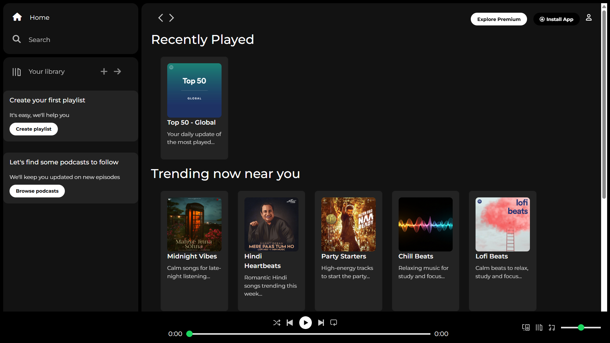

# Spotify-ui-clone
Spotify UI Clone 🎧

A front-end Spotify web player UI clone built using HTML and CSS.
This project recreates the layout and design of Spotify's interface including the sidebar navigation, music cards section, and the bottom music player.

---

🚀 Features

- Spotify-like sidebar navigation
- Music card layout for playlists
- Hover effects on cards and icons
- Custom music player bar
- Scrollable content section
- Basic responsive card layout

---

🛠️ Technologies Used

- HTML5
- CSS3
- Flexbox Layout
- Responsive Design

---

📸 Preview

## Preview

---

📂 Project Structure

spotify-ui-clone
│
├── index.html
├── style.css
│
├── assets
│   ├── images
│   ├── icons
│   └── preview.png
│
└── README.md

---

## Live Demo
🔗 [Open the website](https://sakshamkumarsharma.github.io/Spotify-ui-clone)

---

🔮 Future Improvements

- Add JavaScript music player functionality
- Implement Play / Pause button
- Dynamic progress bar
- Improve mobile responsiveness
- Add song switching functionality

---

📚 What I Learned

This project helped me practice:

- Building layouts using CSS Flexbox
- Designing music streaming UI
- Creating responsive card sections
- Organizing projects for GitHub

---

📄 License

This project is licensed under the MIT License.
